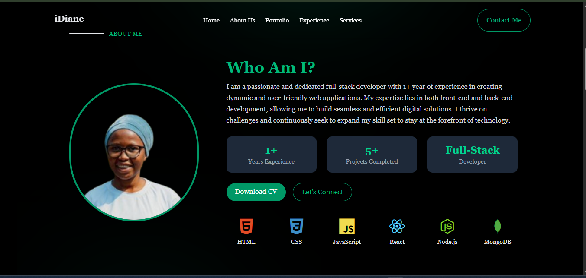
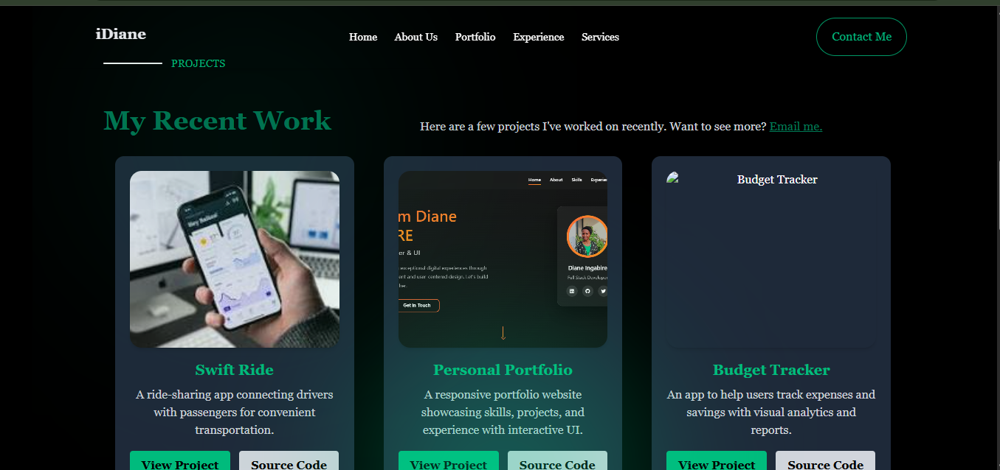
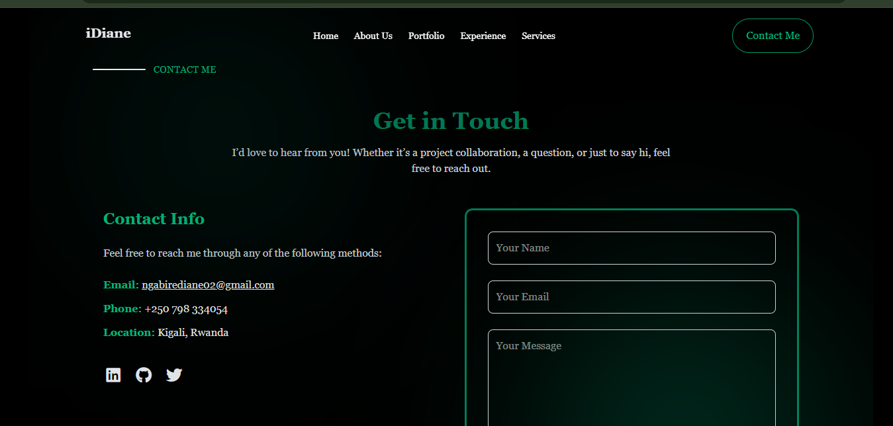

# Diane Ingabire Portfolio

Welcome to **Diane Ingabire's Portfolio**! This is a personal website showcasing my skills, projects, and experience as a **full-stack developer in training**. The portfolio is built using **HTML and Tailwind CSS**, with interactive animations and responsive design.

---

## Pages

This portfolio contains the following pages:

- **Home:** Landing page with hero section and introduction.  
- **About Me:** Highlights my skills, experience, and professional background.  
- **Portfolio:** Showcases recent projects with links to live demos and source code.  
- **Contact:** Contact information and a functional contact form.  

---

## Screenshot

  
  
  
  

---

## Features

- **Animated Hero Section:** Dynamic introduction with interactive cards and floating animations.  
- **About Me Section:** Highlights skills, experience, and professional background.  
- **Projects Section:** Displays recent projects with links to live demos and source code.  
- **Contact Section:** Includes contact information and a functional contact form.  
- **Responsive Design:** Works on mobile, tablet, and desktop screens.  
  

---

## Technologies Used

- **Frontend:** HTML5, Tailwind CSS  
- **Icons & Assets:** FontAwesome, Devicon  
- **Animations:** Custom CSS animations for floating cards   
- **Other Tools:** VS Code for development  

---

## Live Deployment

You can view the live portfolio here:  
[View Portfolio](https://id-portfolio-zeta.vercel.app/)  


---

## How to Run Locally

1. Clone the repository:

```bash
git clone https://github.com/yourusername/portfolio.git

```

2. Navigate into the project folder:

  ```bash
  cd portfolio
  ```

3. Open index.html in your preferred browser.