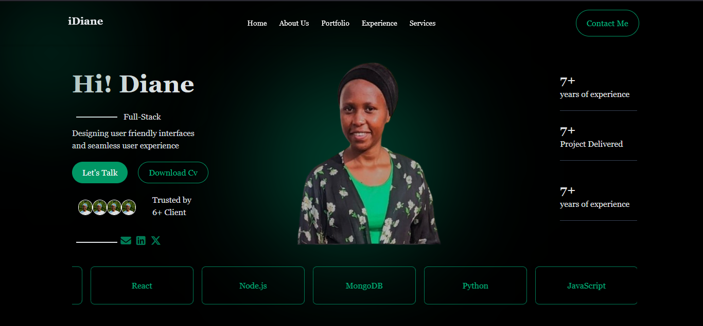

# Diane Ingabire Portfolio

Welcome to **Diane Ingabire's Portfolio**! This is a personal website showcasing my skills, projects, and experience as a **full-stack developer in training**. The portfolio is built using **HTML, Tailwind CSS, and JavaScript**, with interactive animations and responsive design.

---

##  Screenshot

  
*Replace this image with a screenshot of your homepage.*

---

##  Features

- **Animated Hero Section:** A dynamic introduction with interactive cards and floating animations.
- **About Me Section:** Highlights skills, experience, and professional background.
- **Projects Section:** Displays recent projects with links to live demos and source code.
- **Contact Section:** Includes contact information and a functional contact form.
- **Responsive Design:** Works on mobile, tablet, and desktop screens.
- **Dark Theme:** Sleek dark mode with accent colors to highlight content.

---

##  Technologies Used

- **Frontend:** HTML5, Tailwind CSS, JavaScript
- **Icons & Assets:** FontAwesome, Devicon
- **Animations:** Custom CSS animations for floating cards and blobs
- **Other Tools:** VS Code for development

---

##  How to Run Locally

1. Clone the repository:

```bash
git clone https://github.com/yourusername/portfolio.git


